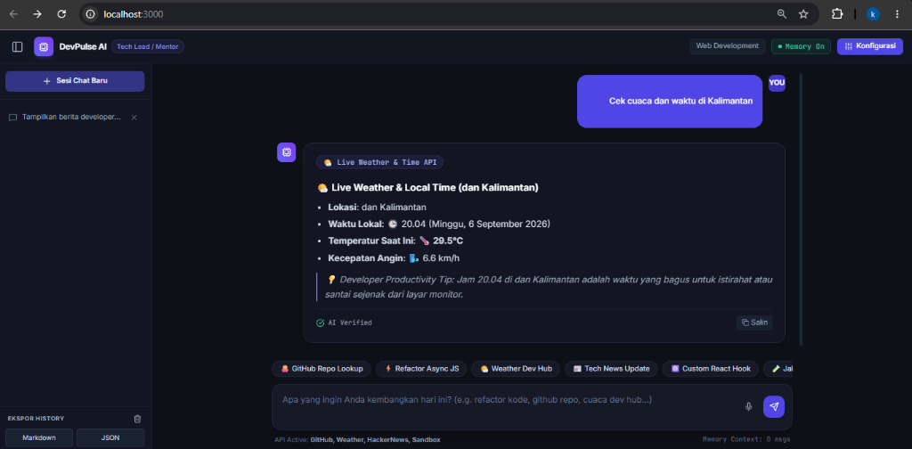
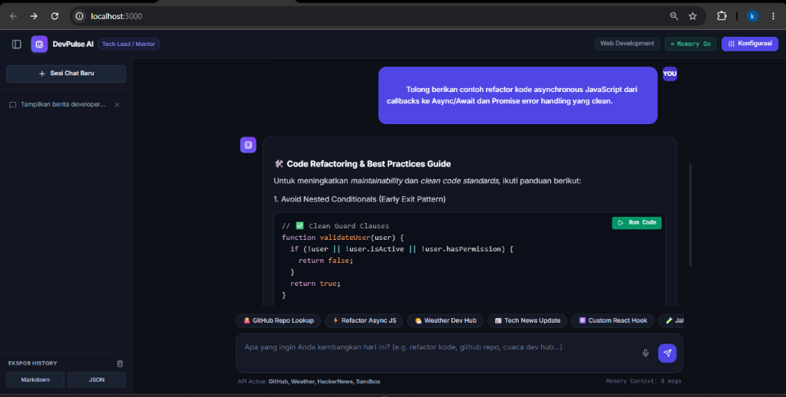
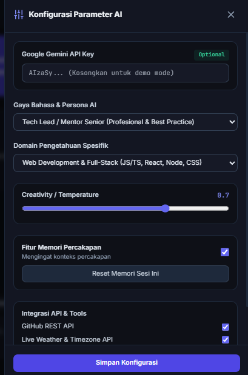

# DevPulse AI — AI Productivity & AI API Integration for Developers 🚀

[](https://github.com/khalilurrahmanmahdi12/AI-Productivity-and-AI-API-Integration-for-Developers)
[](https://vitejs.dev/)
[](https://tailwindcss.com/)
[](LICENSE)

**DevPulse AI** adalah aplikasi chatbot berbasis Artificial Intelligence (NLP / LLM) yang dirancang khusus untuk meningkatkan produktivitas pengembang perangkat lunak (*developers*). Aplikasi ini memberikan fleksibilitas penuh kepada pengguna untuk mengatur konfigurasi parameter AI secara kreatif, serta mengintegrasikan berbagai **API Eksternal** secara *real-time*.

📌 **URL Repositori GitHub**: [https://github.com/khalilurrahmanmahdi12/AI-Productivity-and-AI-API-Integration-for-Developers](https://github.com/khalilurrahmanmahdi12/AI-Productivity-and-AI-API-Integration-for-Developers)

---

## 📸 Screenshots User Interface

### 1. Live Weather & Local Time API Integration


### 2. Code Refactoring & In-Chat JS Code Sandbox Executor


### 3. Panel Konfigurasi Parameter AI (Persona, Domain, Temperature, Memory, API Keys)


---

## 🌟 Fitur Utama & Konfigurasi Parameter Kreatif

### 🎯 1. Parameter Kreatif AI (AI Customizations)
- **Gaya Bahasa & Persona AI**:
  - 🧠 **Tech Lead / Mentor Senior**: Jawaban mendalam, terstruktur, fokus pada *best practices* & *clean code*.
  - ☕ **Santai / Casual Dev**: Gaya bahasa rekan sejawat (friendly, solutif, komunikatif).
  - ⚡ **Code Optimizer**: Jawaban ringkas, to-the-point, berfokus pada efisiensi algoritma (Big-O notation).
  - 📜 **Formal & Structured**: Bahasa Indonesia baku, dokumentasi rapi dengan poin-poin sistematis.
  - 👶 **ELI5 (Explain Like I'm 5)**: Penjelasan konsep rumit dengan analogi dunia nyata.
- **Domain Pengetahuan Spesifik**:
  - 🌐 *Web Development & Full-Stack* (JS/TS, React, Node, CSS)
  - 📊 *Data Science & AI/ML* (Python, PyTorch, SQL, Prompt Engineering)
  - ☁️ *DevOps & Cloud Architecture* (Docker, K8s, CI/CD, AWS)
  - 🏛️ *System Design & Security* (Microservices, Scalability, Caching)
  - 💼 *Career & Productivity* (Code Review, Portfolio, Workflow Tools)
- **Creativity / Temperature Slider**: Pengaturan rentang 0.0 (Presisi) hingga 1.0 (Kreatif).

### 🧠 2. Fitur Memori Percakapan (Conversation Memory)
- Mengingat riwayat percakapan sebelumnya (*multi-turn conversation*).
- Indikator status memori aktif pada header.
- Fitur *Reset Memory* untuk menghapus riwayat konteks tertentu.

### 🔌 3. Integrasi API Eksternal (Live External Tools)
1. 🐙 **GitHub REST API Inspector**: Mengambil informasi repositori publik (stars, forks, open issues, lisensi) dan profil pengembang secara langsung.
2. 🌤️ **Live Weather & Timezone API**: Mengecek cuaca & waktu lokal di pusat teknologi dunia (Jakarta, Kalimantan, Tokyo, San Francisco, London).
3. 📰 **HackerNews Developer Feed**: Menampilkan tren berita teknologi terbaru dari HackerNews API.
4. 🧪 **In-Chat JavaScript Code Sandbox**: Eksekusi snippet kode JS secara aman langsung di dalam UI percakapan dengan *console capture*.

### ⚡ 4. Fitur Produktivitas Tambahan
- 📝 **Preset Template Prompt Quick Action**: Pilihan prompt siap pakai (*Refactor Code, React Hooks, GitHub Search, Tech News*).
- 📂 **Ekspor Riwayat Chat**: Simpan percakapan ke format **Markdown (.md)** atau **JSON (.json)**.
- 🎤 **Voice Input (Speech-to-Text)**: Masukkan pesan menggunakan suara.
- 🎨 **Code Syntax Highlighting**: Formatting kode otomatis dengan Prism.js.
- 🔑 **Model Dual-Engine Support**: Mendukung Google Gemini API Key secara langsung, dan dilengkapi *Smart Fallback Engine* bawaan yang siap dijalankan tanpa API key.

---

## 🛠️ Panduan Instalasi & Menjalankan Lokal

### Prasyarat
- **Node.js**: v18.x atau lebih baru
- **npm**: v9.x atau lebih baru

### Langkah-langkah:
1. **Clone Repositori**:
   ```bash
   git clone https://github.com/khalilurrahmanmahdi12/AI-Productivity-and-AI-API-Integration-for-Developers.git
   cd AI-Productivity-and-AI-API-Integration-for-Developers
   ```

2. **Install Dependensi**:
   ```bash
   npm install
   ```

3. **Jalankan Development Server**:
   ```bash
   npm run dev
   ```
   Aplikasi dapat diakses melalui browser di `http://localhost:3000`.

4. **Build untuk Production**:
   ```bash
   npm run build
   ```

---

## 📂 Struktur Repositori

```text
├── index.html                  # Main HTML Entry Point
├── package.json                # Project dependencies & scripts
├── vite.config.js              # Vite configuration
├── README.md                   # Repositori & Dokumentasi Proyek
├── screenshots/                # Real User Interface Screenshots
│   ├── 1_weather_api.png       # Live Weather API screenshot
│   ├── 2_code_refactor_sandbox.png # Code refactoring & Sandbox screenshot
│   └── 3_ai_parameter_config.png   # AI Parameter Config modal screenshot
└── src/
    ├── main.js                 # Entry Point Script & Event Handlers
    ├── style.css               # Custom Styles & Tailwind imports
    ├── components/
    │   └── PromptTemplates.js  # Quick Action Prompt Presets
    └── services/
        ├── aiService.js        # AI Engine & Gemini API Integration
        └── externalApis.js     # GitHub, Weather, News & Sandbox APIs
```

---

## 📄 Lisensi & Kontribusi
Proyek ini dibuat untuk memenuhi tugas **Final Project: AI Productivity and AI API Integration for Developers**.  
Lisensi: **MIT License**.
